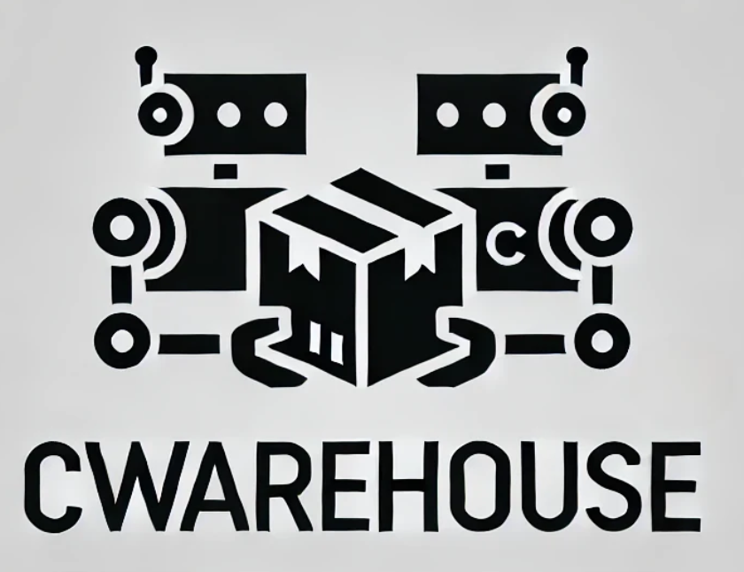
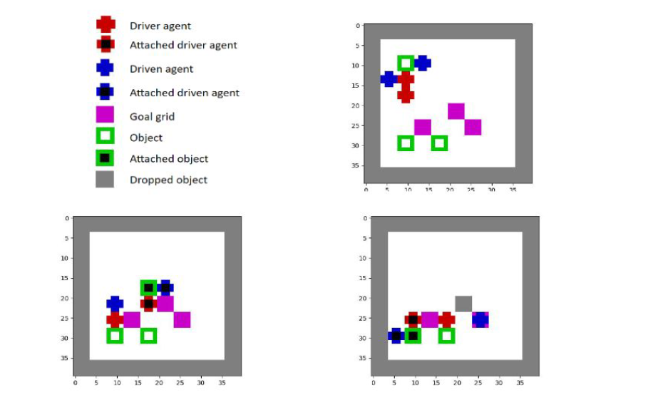

<p align="center">
 
 <p align="center">A multi-agent reinforcement learning environment</p>
</p>

[](https://GitHub.com/Naereen/StrapDown.js/graphs/commit-activity)
[](https://github.com/Naereen/StrapDown.js/blob/master/LICENSE)


<h1>Table of Contents</h1>

- [Environment Description](#environment-description)
  - [Configurable Environment parameter](#parameters-like)
  - [Observation Space](#observation-like)
  - [Action Space](#action-space)
  - [Rewards](#rewards)
- [Environment Parameters](#environment-parameters)
  - [Configurable parameters](#parameters)
  - [Custom layout](#custom-layout)
- [Installation](#installation)
- [Getting Started](#getting-started)


# Environment Description

Collaborative Warehouse (CWarehouse) is a gridworld-based multi-agent reinforcement learning environment
built on OpenAI Gym. The grid world represents a physical warehouse
consisting of objects, designated goal regions for those objects, and robotic agents. The
objective in the CWarehouse environment is for these agents to pick up and move objects
to the goal area. The agents are of two kinds: driver and driven agents. When an episode
starts, a number of objects, agents, and goals are scattered randomly in the grid area.
The driver and driven agents have to navigate towards an object, pick it up, and together
move the object to a goal cell and drop the object in the goal cell. This process has to be
completed for all the objects, leading to a successful episode when all objects have been
transferred and dropped in the goal cells.
Initially, both the driver and driven agents move towards an object to pick it up. Once
the object is attached to both agents, the attached driven agent ceases all actions. The
composite object (comprising the attached object, attached driven agent, and driver
agent) is then moved by the action choices of the attached driver agent, which drives the
composite object to a goal area and drops the attached object there. When an attached
object is dropped in the goal cell, it becomes immovable, and both attached driver and
driven agents become free. They can then navigate and repeat the process with other
objects. An object can only be attached and moved when it is picked up by both the
driver and driven agents. An episode ends when all objects are dropped in the goal or
if the episode length exceeds a specified maximum episode length.


Below is an illustration of collaborative warehouse with its elements; two pairs of driver and driven agent. 

<p align="center">
 
</p>


## Configurable Environment parameters


## Action Space
Agents have the following discrete action space:

A={ Left, Right, Down, Up, Pick/Drop, Do nothing }

When the agent is not attached; pick action is available, when the agent is attached to an object; drop action is available.

## Observation Space
There is an option for partial or fully observable and also image or vector observation. Image observation always give full observation of the grid.
In case of partial observation agent gets a partially observable vector observation. The observation also includes information about its position in the grid, whether the agent itself is a driver or driven, attached or not, and further details about attachable objects and free goal cells. The observation is limited to a partial grid area with the agent at its center. By default, a 3x3 grid area is partially observable with the agent at the center. Other agents and their information are only known by the agent if they are within this grid area.


- 
## Rewards
There is a two-step reward system for the agents. When an object is successfully picked up by both
agents (i.e., driver and driven), they each receive a reward of 0.75. If the attached object
is successfully dropped in the goal, both agents receive a high reward of 1.25. There is
also a penalty of -0.01 for move failures. Move failures refer to action choices that agents
attempt but cannot execute, such as when an agent chooses a action which may result in
collision with another agent or object. This penalty motivates agents to avoid collisions
during their movement planning. A small penalty of -0.05 is added for every step, which
encourages agents to minimize their number of moves. At each step, all these rewards and
penalties are added for each agent, resulting in the return of that agent for that timestep.


# Installation

```sh
git clone https://github.com/j-thapa/collaborative_warehouse.git
cd collaborative_warehouse
pip install -e .
```

# Getting Started

Here is a simple code example briefing how CWarehouse can be used. In this example, both agents has random policies which selects an action when observation is received.

```python
from cwarehouse.warehouse_env import WarehouseMultiEnv
import numpy as np
env = WarehouseMultiEnv(max_steps=10,image_observation=True)
env_info = env.get_env_info()

n_actions = env_info["n_actions"]
n_agents = env_info["n_agents"]


n_episodes = 10

for e in range(n_episodes):
 
    env.reset()
    terminated = False
    episode_reward = 0

    while not terminated:
        obs = env.get_obs()
        state = env.get_state()

        actions = []
        for agent_id in range(n_agents):
            avail_actions = env.get_avail_agent_actions(agent_id)
            avail_actions_ind = np.nonzero(avail_actions)[0]
            action = np.random.choice(avail_actions_ind)
            actions.append(action)

        local_obs, _, rewards, dones, infos, available_actions = env.step(actions)
        terminated = dones[0]
        episode_reward += np.mean(rewards)
     

    print("Total reward in episode {} = {}".format(e, episode_reward))

env.close()


```


